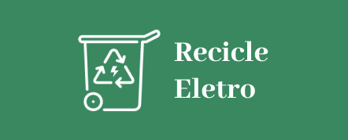

<h1 align="center">
    <br>
    <p align="center">Projeto Final {Reprograma On15}<p>
</h1>
<p align="center">

</p>
<br>

## 💻 Sobre o projeto 
</br>

API desenvolvida como Projeto Final com o auxílio da professora Hannah Freitas para a conclusão do curso de Backend da Reprograma.

<p align="justify">Este projeto nasceu da minha vontade de fazer o descarte do celular corretamente, onde encontrei dados informando que a maioria dos brasileiros (87%) guarda algum tipo de eletroeletrônico sem utilidade em casa e mais de 30% ficam com eles por mais de um ano; Os brasileiros ainda não sabem o que é resíduo eletrônico e como descartá-lo, segundo pesquisa de 2021 da Green Eletron; Apenas 7% dão destino correto ao resíduo eletrônico.

<p align="justify">A API permite o cadastro de usuários que estão querendo fazer uma pesquisa dos locais de descarte do material eletrônico, onde será possível realizar o cadastro, pesquisa locais de descarte, atualizar usuário/local e deleta usuário/local.

## 📚 Aprendizados

> ⚠️ O projeto final consiste em uma API fundamentada no CRUD. O CRUD é um acrônimo para Create(CRIAR), Read(LER-CONSULTAR), Update(ATUALIZAR) e Delete(DELETAR). 
  
</br>

| OPERAÇÃO | Descrição                                  |
| -------- | ------------------------------------------ |
| C`REATE` | Criar um novo registro                     |
| R`EAD`   | Ler um registro, ou uma lista de registros |
| U`PDATE` | Atualizar um registro                      |
| D`ELETE` | Excluir um registro                        |

<br>

## 🛠️ Tecnologias utilizadas nesse projeto

<br>

Para a construção do projeto, as seguintes tecnologias foram utilizadas:
- [JavaScript](https://www.javascript.com/)
- [Git/Github](https://github.com/)
- [Node.js](https://nodejs.org/en/)
- [MongoDb](https://www.mongodb.com/)
- [Postman](https://www.postman.com/)
- [Vscode](https://code.visualstudio.com/)
- [heroku](https://dashboard.heroku.com/apps)  

### Pacotes Utilizados 

- [Express](https://expressjs.com/pt-br/)
- [Nodemon](https://nodemon.io/)
- [dotenv](https://www.npmjs.com/package/dotenv)
- [Mongoose](https://mongoosejs.com/)
- [cors](https://www.npmjs.com/package/cors)
- [JWT](https://www.npmjs.com/package/jsonwebtoken)
- [Bcrypt](https://www.npmjs.com/package/bcrypt)

<br>

## 📁 Arquitetura MVC 

```
 📁 cestas-solidarias
   |
   |-  📁 src
   |    |
   |    |- 📁 controller
   |         |- 📑 localDescarteController.js
   |         |- 📑 usuarioController.js   |     
   |
   |    |- 📁 database
   |         |- 📑 mongoConfig.js
   |
   |
   |    |- 📁 models
   |         |- 📑 localDescarteSchema.js
   |         |- 📑 usuarioSchema.js   |         
   |
   |    |- 📁 routes
   |         |- 📑 localDescarteRoutes.js    |         
   |         |- 📑 usuarioRoutes.js
   |
   |    |- 📑 app.js
   |       
   |
   |- 📑 .env
   |- 📑 .env.example
   |- 📑 .gitignore
   |- 📑 package-lock.json
   |- 📑 package.json
   |- 📑 README.md
   |- 📑 server.js
```
<br>

## 💻 Instruções para utilização da API
<br>
Essas instruções fornecerão uma cópia do projeto instalado e funcionando em sua máquina local para fins de desenvolvimento e teste.

### 1º Passo - Clonar o respositório
Comece clonando esse projeto para a sua máquina local.
```sh
git clone https://github.com/paola-rodrigues/Reprograma_ProjetoFinal
```

### 2. Digite a linha abaixo para entrar na pasta correta: 
```sh
cd ProjetoFinal> 
```
### 2º Passo - Instalando as dependências
Para instalar as dependências do projeto, digite o seguinte comando no terminal:
```sh
npm install
```

### 3º Passo - Configurar o ambiente
Para configurar o ambiente é necessário duplicar o arquivo `.env.example` e renomea-lo somente para `.env`.</br>
Em seguida, altere as informações desse arquivo `.env` para as informações correspondentes a sua máquina e e inclua as variáveis e os valores
MONGO_URI = URL do MongoDb Atlas Banco de dados orientado a documentos e interface na nuvem.

### 4º Passo - Executando a aplicação
Depois de tudo configurado, é hora de rodar a nossa aplicação, para executá-la basta digitar o seguinte comando no terminal:
```sh
npm start
```
<br>

## 🔃 Retorna teste com apresentação: 
<br>

| Método HTTP  | Endpoint                     | Descrição                            |
| ------------ | ---------------------------- | ------------------------------------ |
| GET          | `http://localhost:7060/`     |  Mensagem de apresentação            |

</br>

## 🔃 Manipulação das Rotas de Usuários:

<br>

| Método HTTP  | Endpoint                | Descrição                            |
| ------------ | ----------------------- | ------------------------------------ |
| GET          | `/users`                | Retorna todos os usuários            |
| GET          | `/users/filtrar/:id`   | Retorna ID do usuário               n |
| POST         | `/users/create`         | Cria/cadastra um novo usuário        |
| PUT          | `/users/update/:id`     | Altera informações de um usuário     |
| DELETE       | `/users/delete/:id`     | Deleta um usuário específico         |

</br>


## 🔃 Manipulação das Rotas de locais de descarte do maaterial eletrônico:

<br>

| Método HTTP  | Endpoint                | Descrição                            |
| ------------ | ----------------------- | ------------------------------------ |
| GET          | `/local`                | Retorna todos os locais para descarte|
| GET          | `/local/filtrar/:id`   | Retorna ID do local de descarte       |
| POST         | `/local/create`         | Cria/cadastra um novo local          |
| PUT          | `/local/update/:id`     | Altera informações de um local       |
| DELETE       | `/local/delete/:id`     | Deleta um local específico           |

</br>


## 👨‍💻 Autora

<td align="center"><a href="https://github.com/paola-rodrigues">
 </td><br> 

- [linkedin](https://www.linkedin.com/in/paoladonascimento/)


## 🥰 Agradecimentos:
<br>

 <p align="center">Eu quero agradecer a Deus e também a todos da minha família  principalmente meus pais. Agradeço a todas da Reprograma pela oportunidade e disposição para ajudar. </p >
<p align="center">TODAS DA REPROGRAMA, SÃO INCRÍVEIS "Gratidão" MEU ETERNO AGRADECIMENTO </p >
<p align="center">Obrigada!!</p >

</br>